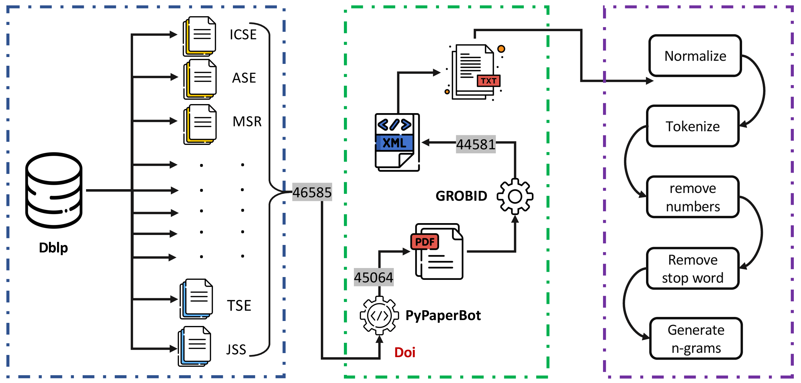

# Research Diagrams

A curated collection of diagrams from research papers in statistics, computational biology, machine learning, and software engineering, focusing on computational workflows and architecture descriptions.

## Table of Contents

- [Highly accurate protein structure prediction with AlphaFold](#highly-accurate-protein-structure-prediction-with-alphafold)
- [The general index of software engineering papers](#the-general-index-of-software-engineering-papers)
- [Attention is all you need](#attention-is-all-you-need)
- [Training language models to follow instructions with human feedback](#training-language-models-to-follow-instructions-with-human-feedback)

## Highly accurate protein structure prediction with AlphaFold

Source: <https://doi.org/10.1038/s41586-021-03819-2>

Figure 3: Architectural details. a, Evoformer block. Arrows show the information flow. The shape of the arrays is shown in parentheses.

## The general index of software engineering papers

Source: <https://doi.org/10.1145/3524842.3528494>

Figure 1: Dataset construction pipeline.

## Attention is all you need

Source: <https://dl.acm.org/doi/10.5555/3295222.3295349>

Figure 1: The Transformer - model architecture.

## Training language models to follow instructions with human feedback

Source: <https://doi.org/10.48550/arXiv.2203.02155>

Figure 2: A diagram illustrating the three steps of the method.
